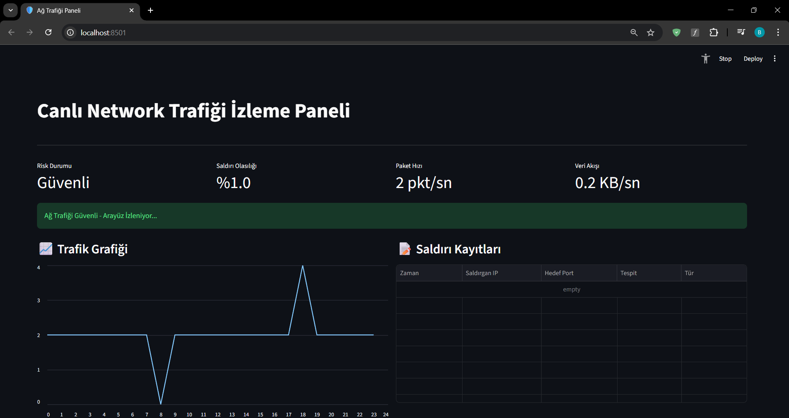
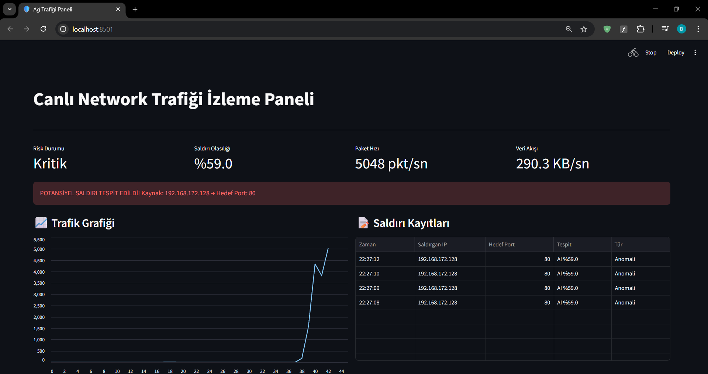
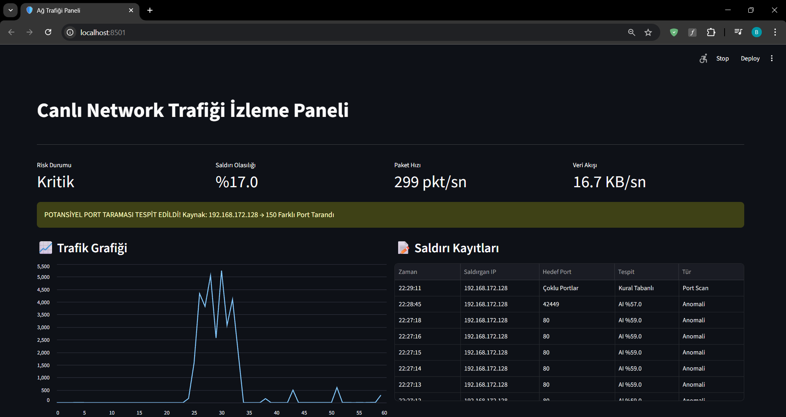

# 🛡️ DDoS & Port Scan Attacks Detection


This project is an Intrusion Detection System (IDS) that monitors local network traffic in **real-time**. It detects **DDoS** and **Port Scan** attacks using a hybrid structure of machine learning and rule-based analysis.

Developed within the scope of a Cyber Security course, this system captures network packets, extracts specific features, and analyzes them with a trained machine learning model.

## Project Interface and Demo

Screenshots showing how the system works are below. The interface is developed using **Streamlit**.

### 1. Normal Network Traffic (Safe State)
The system is listening to the network, the traffic flow is normal, and no threats are detected.


### 2. DDoS Attack Detection (Anomaly)
Packet rate suddenly increases (5048 pkt/s) due to a SYN Flood attack made with `hping3`. The Random Forest model classifies this situation as an anomaly with **59% probability**.


### 3. Port Scan Detection (Rule-Based)
During an `nmap` scan, a single IP address is detected checking **150 different ports** in a short time, and the rule-based alarm is triggered.


---

## Detection Architecture and Feature Extraction

The system extracts the following **7 basic statistical features** from each packet flow using the Scapy library and feeds them to the Random Forest model:

1.  **Flow Duration:** Duration of the flow.
2.  **Tot Fwd Pkts:** Total number of forward packets.
3.  **Tot Bwd Pkts:** Total number of backward packets.
4.  **TotLen Fwd Pkts:** Total size of forward packets.
5.  **TotLen Bwd Pkts:** Total size of backward packets.
6.  **Fwd Pkt Len Max:** Maximum size among forward packets.
7.  **Fwd Pkt Len Min:** Minimum size among forward packets.

**Hybrid Detection Logic:**
* **DDoS Detection:** Predictions are made by the ML model using the features above.
* **Port Scan Detection:** Detected by a rule-based approach if a single source IP sends requests to **more than 15** different destination ports within a specific time window.

---

## Installation and Setup

Follow the steps below to run the project on your own computer.

### 1. Clone the Repository
```bash
git clone git clone https://github.com/BerkayyKaya/DDoS-PortScan-Attacks-Detection.git
```

### 2. Create a New Virtual Environment
```
python -m venv attack-detection
```

### 3. Activate the Virtual Environment
```
attack-detection\Scripts\activate
```

### 4. Install Required Libraries
```
pip install -r requirements.txt
```

### 5. Update the Code File
Go to the app.py file located in the src folder. Edit the lines below according to your own system configuration and save the file.
```
MODEL_PATH = "YOUR_MODEL_PATH"
INTERFACE_NAME = "YOUR_INTERFACE_NAME"
```

### 6. Start the Interface
Run the code below in the terminal where you activated the virtual environment to start the interface.
```
streamlit run ./src/app.py
```